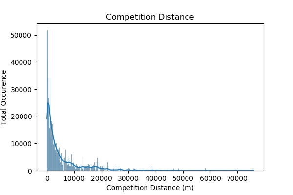
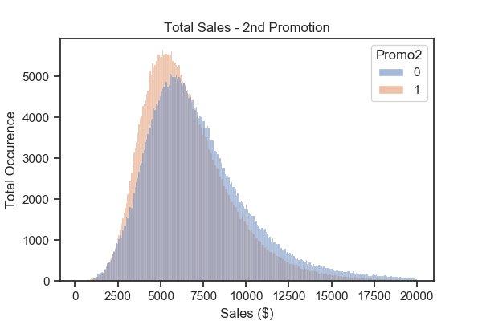

# Rossman Store Sale
Forecast sales using store, promotion, and competitor data

## Summary:
Rossmann operates over 3,000 drug stores in 7 European countries. Currently, Rossmann store managers are tasked with predicting their daily sales for up to six weeks in advance. Store sales are influenced by many factors, including promotions, competition, school and state holidays, seasonality, and locality. With thousands of individual managers predicting sales based on their unique circumstances, the accuracy of results can be quite varied.

We prepared the data, performed exploratory data analysis, and evaluate 4 regression models.
- - -
### Exploratory Data Analysis:

* We've identified outliers in our dataset. While we understand that the outliers in themselves can tell important stories about our data, we will be excluding them from the rest of our analysis for more control. We will cap max sales at $22K and max customers at 3000 per day. 

* Competition distance matters. There are more customers when the competition is closer. 

* While we are seeing more customers when the competion distance is closer, we are not seeing greater sales with respect to competition distance. There is a normal distribution for sales with respect to competition distance. 

* There are more larger sales with promotions taking place, however, when there is a second promotion in place, the same sales trend is note observed. 

* Less sales are observed during school holidays. This could be due to families taking trips out of town during school holidays. 

* We do not observe a change in customers count and sales around over the years, or throughout the years (when observed by months). However, as we increase the granularity of our observation to day of the week, we do observe changes. We are seeing a more uniform distribution in sales amount, and wider and more uniform distribution of customers count on day 7.

- - -
### Machine Learning Models