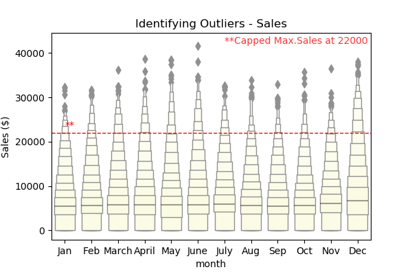
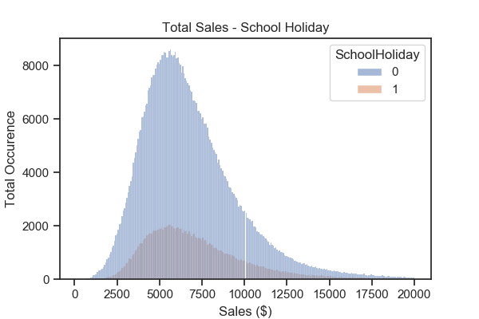
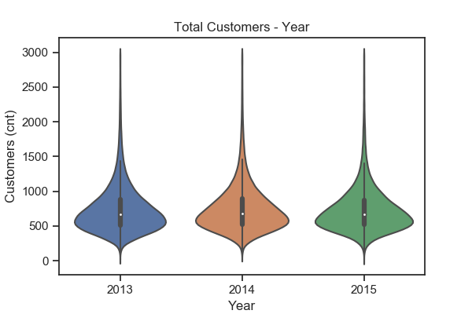
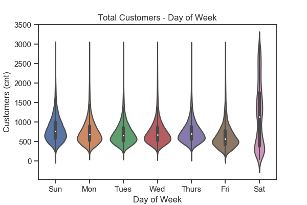

# Rossman Store Sale
Forecast sales using store, promotion, and competitor data

## Summary:
Rossmann operates over 3,000 drug stores in 7 European countries. Currently, Rossmann store managers are tasked with predicting their daily sales for up to six weeks in advance. Store sales are influenced by many factors, including promotions, competition, school and state holidays, seasonality, and locality. With thousands of individual managers predicting sales based on their unique circumstances, the accuracy of results can be quite varied.

We prepared the data, performed exploratory data analysis, and evaluate 6 regression models.
- - -
### Exploratory Data Analysis:

* We've identified outliers in our dataset. While we understand that the outliers in themselves can tell important stories about our data, we will be excluding them from the rest of our analysis for more control. We will cap max sales at $22K and max customers at 3000 per day. 

* Competition distance matters. There are more customers when the competition is closer. 

* While we are seeing more customers when the competion distance is closer, we are not seeing greater sales with respect to competition distance. There is a normal distribution for sales with respect to competition distance. 

* There are more larger sales with promotions taking place, however, when there is a second promotion in place, the same sales trend is note observed. 

* Less sales are observed during school holidays. This could be due to families taking trips out of town during school holidays. 

* We do not observe a change in customers count and sales around over the years, or throughout the years (when observed by months). However, as we increase the granularity of our observation to day of the week, we do observe changes. We are seeing a more uniform distribution in sales amount, and wider and more uniform distribution of customers count on day 7.

- - -
### Machine Learning Models
* Regression models are commonly used for market forecasting, predicting future revenue; and, in our data set, to make predictions on an output value given a new input.  Of the many ways to include numerous features, we processed the data and narrowed our features to 12.
* Initially, we compared the performance of four machine learning regression models we covered from Sklearn’s libraries.  Consistent with sklearn libraries generally, we define the model object, fit the model to the data, then made predictions and evaluated the model.
#### Multiple Linear Regression

* Multiple linear regression utilized the model.score method to evaluate and contrast models & residual plots where available; included for all is a sample plot for the first 25 predicted vs actual values, which visually represents the overall model score.
#### Ridge Model

* Overall, model scores were very similar.
#### ElasticNet Model

#### Lasso Model

* The models answer our central questions: to analyze and predict sales.  86% of the variation in sales can be explained by the independent variables (features used) in a Linear, Lasso, Ridge, or ElasticNet regression model.
#### SGD Regressor Model

* We also looked at the performance of the SGD (stochastic gradient descent) regressor model.  StandardScaler was used to scale the dataset, and we found the model score remained relatively the same.
#### LightGBM Regressor Model

* Exploring different ways that other analysts’ work have utilized regression models to predict future sales, we focused on a machine learning framework originally developed by Microsoft LightGBM (Light Gradient Boosting Machine). This model was evaluated to have the best r2 value, at 98% vs 86%, the highest accuracy of all the models tested.
* Regardless of the model utilized to make predictions, given a set of twelve featured data points we can use model.predict() to predict sales.
